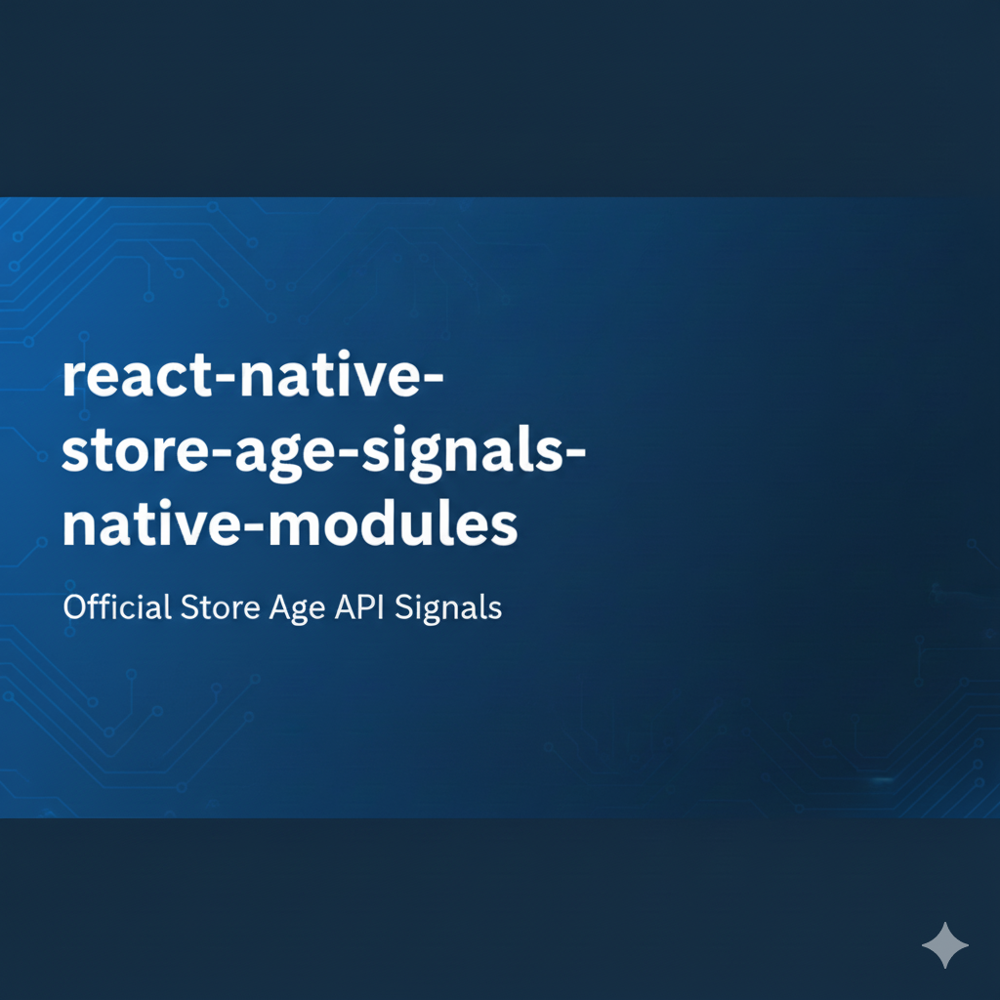
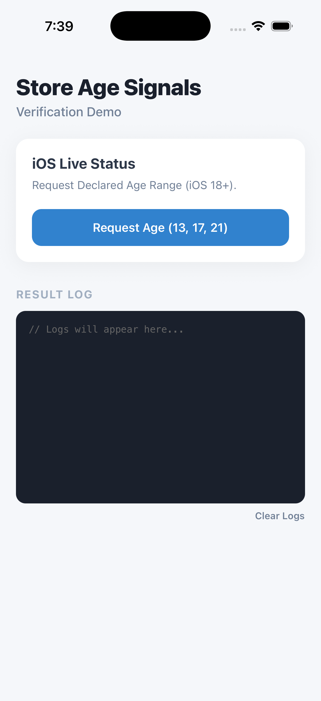
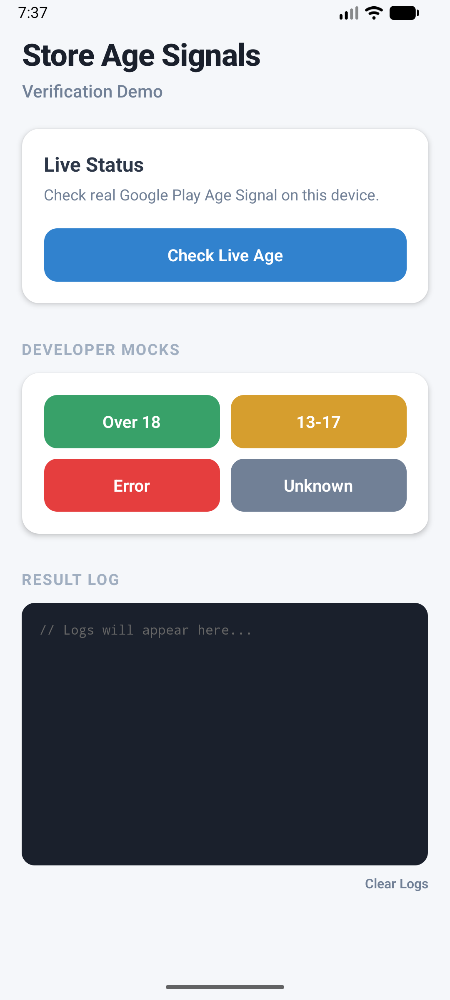
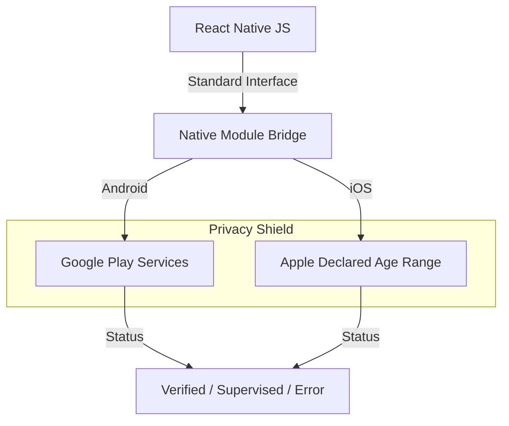

<div align="center">
  
  
</div>

# React Native Store Age Signals

[](https://www.npmjs.com/package/react-native-store-age-signals-native-modules)
[](LICENSE)
[](https://facebook.github.io/react-native/)
[](https://www.typescriptlang.org/)

**A production-grade React Native module for verifiable age signals.**

Seamlessly integrate with **Apple's Declared Age Range API** (iOS 18+) and **Google Play Age Signals API** to meet state-level age verification compliance (e.g., Texas, Utah, Louisiana) without handling sensitive PII yourself.

---

## 🚀 Features

- **🛡️ Privacy-First**: Leverages OS-level store APIs. You never see the user's birthdate.
- **🍎 iOS Integration**: Native support for `DeclaredAgeRange` framework.
- **🤖 Android Integration**: Wrapper for Google Play `AgeSignalsApi`.
- **🧪 Mock Mode**: Built-in developer tools to simulate all age scenarios on Simulators and Emulators.
- **⚡ Zero Config Mocks**: Verification logic works out-of-the-box for development.

## 🏗️ Architecture



## 📦 Installation

```sh
npm install react-native-store-age-signals-native-modules
# or
yarn add react-native-store-age-signals-native-modules
```

## ⚙️ Setup

### 🍎 iOS Setup

1.  **Framework Requirements**:
    - **iOS 18.0+** is required for the API to function.
    - Older versions will return a fallback/unavailable response.

2.  **Install Pods**:
    ```sh
    cd ios && pod install
    ```

3.  **Entitlements (Critical)**:
    - You **must** enable the `Declared Age Range` capability in Xcode.
    - Go to **Project Target** -> **Signing & Capabilities** -> **+ Capability** -> **Declared Age Range**.
    - *Note: This capability typically requires a paid Apple Developer Program membership. "Personal Team" profiles may not support it.*

### 🤖 Android Setup

No manual configuration required. The package automatically bundles `com.google.android.play:age-signals`.
- **Requirement**: Device must have Google Play Services installed.

## 💻 Usage

```typescript
import { 
  getAndroidPlayAgeRangeStatus, 
  requestIOSDeclaredAgeRange 
} from 'react-native-store-age-signals-native-modules';
import { Platform } from 'react-native';

// 🤖 Android Example
async function checkAndroid() {
  if (Platform.OS !== 'android') return;

  const result = await getAndroidPlayAgeRangeStatus();

  if (result.userStatus === 'OVER_AGE') {
    // ✅ User is a verified adult
    grantAccess();
  } else if (result.userStatus === 'UNDER_AGE') {
    // ⚠️ User is supervised (e.g. Family Link)
    // result.ageLower and result.ageUpper are available (e.g., 13-17)
    enableRestrictedMode(result.ageLower, result.ageUpper);
  } else {
    // ❌ Verification failed or unknown
    handleError(result.error);
  }
}

// 🍎 iOS Example
async function checkIOS() {
  if (Platform.OS !== 'ios') return;

  try {
    // Request discrete age signals (e.g. 13+, 17+, 21+)
    const result = await requestIOSDeclaredAgeRange(13, 17, 21);

    if (result.status === 'sharing') {
      // ✅ User shared their age range
      console.log(`Confirmed Range: ${result.lowerBound} - ${result.upperBound}`);
    } else {
      // ❌ User declined or API unavailable
      console.log('Status:', result.status);
    }
  } catch (error) {
    console.error('iOS Signal Failed:', error);
  }
}
```

## 🧪 Developer Mock Mode

Testing store APIs usually requires signed production builds. This library includes a powerful **Mock Mode** for development.

```typescript
// Simulate a Supervised User (Age 13-17)
const mockResult = await getAndroidPlayAgeRangeStatus({
  isMock: true,
  mockStatus: 'UNDER_AGE',
  mockAgeLower: 13,
  mockAgeUpper: 17
});
```

## 🔧 API Reference

### `getAndroidPlayAgeRangeStatus(config?)`
Retrieves Android Play Age Signal.

| Parameter | Type | Default | Description |
|---|---|---|---|
| `config.isMock` | `boolean` | `false` | Enable to return fake data. |
| `config.mockStatus` | `enum` | `'OVER_AGE'` | `OVER_AGE` \| `UNDER_AGE` \| `UNKNOWN` |
| `config.mockErrorCode` | `number` | `null` | Simulate API error code (e.g. -1). |

### `requestIOSDeclaredAgeRange(threshold1, threshold2, threshold3)`
Request iOS Age Signal.

| Parameter | Type | Description |
|---|---|---|
| `threshold[1-3]` | `number` | Age thresholds to verify (e.g. 13, 18, 21). |

## 🚨 Troubleshooting

### iOS Errors

| Error Code | Meaning | Solution |
|---|---|---|
| **Error 0** | **Missing Entitlement** | 1. Add `Declared Age Range` capability in Xcode.<br>2. Ensure you are using a **Paid Developer Account**. Personal teams often block this API.<br>3. **Real Device Only**: This API does NOT work on Simulators. |
| **Error -1** | **API Unavailable** | Device is running an iOS version older than 18.0. |

### Android Errors

| Error Code | Meaning | Solution |
|---|---|---|
| **-1 (API_NOT_AVAILABLE)** | Play Store outdated | Update Google Play Store app on device. |
| **-4 (PLAY_SERVICES...)** | Services outdated | Update Google Play Services or test on a device with GMS. |

---

## License
MIT

## Features

- **Android**: Integrates with Google Play Age Signals API.
- **iOS**: Integrates with Apple's `DeclaredAgeRange` framework (iOS 18+).

## Installation

```sh
npm install react-native-store-age-signals-native-modules
# or
yarn add react-native-store-age-signals-native-modules
```

### iOS Setup

1. Run `pod install` in your `ios` directory:
   ```sh
   cd ios && pod install
   ```
3. **Entitlements**: You must enable the "Declared Age Range" capability for your app.
    - Open your project in Xcode.
    - Select your App target -> "Signing & Capabilities".
    - Click "+ Capability" and add **Declared Age Range**.
    - This adds the `com.apple.developer.declared-age-range` entitlement key to your `.entitlements` file.
    *(Without this, the API will fail with "Error 0")*
    > **Note**: This capability may not be available for "Personal Team" (free) provisioning profiles. You likely need a paid Apple Developer Program membership to sign apps with this entitlement.

### Android Setup

This package automatically includes the `com.google.android.play:age-signals` dependency.
- **Requirements**: Google Play Services must be available on the device.

## Usage

```js
import { 
  getAndroidPlayAgeRangeStatus, 
  requestIOSDeclaredAgeRange 
} from 'react-native-store-age-signals-native-modules';
import { Platform } from 'react-native';

// Android: Check Play Age Range (Real)
async function checkAndroidAge() {
  if (Platform.OS !== 'android') return;

  const result = await getAndroidPlayAgeRangeStatus();
  
  if (result.userStatus === 'OVER_AGE') {
    console.log('User is verified adult');
  } else if (result.userStatus === 'UNDER_AGE') {
    console.log(`User is supervised. Range: ${result.ageLower}-${result.ageUpper}`);
  } else if (result.errorCode) {
     console.error(`API Error: ${result.errorCode}`);
  }
}

// Android: Mock Usage (Development/Testing)
async function checkMockAge() {
  // 1. Simulate Supervised User (13-17)
  const supervised = await getAndroidPlayAgeRangeStatus({
    isMock: true,
    mockStatus: 'UNDER_AGE',
    mockAgeLower: 13,
    mockAgeUpper: 17
  });

  // 2. Simulate API Error (e.g. Play Store outdated)
  const error = await getAndroidPlayAgeRangeStatus({
    isMock: true,
    mockErrorCode: -6 
  });
}

// iOS: Request Declared Age Range
async function checkIOSAge() {
  if (Platform.OS !== 'ios') return;

  // Define your age thresholds (e.g., 13, 17, 21)
  const result = await requestIOSDeclaredAgeRange(13, 17, 21);
  
  if (result.status === 'sharing') {
    console.log('Lower Bound:', result.lowerBound);
    console.log('Upper Bound:', result.upperBound);
  } else {
    console.log('Status:', result.status); // 'declined', 'unknown'
  }
}
```

## API Reference

### `getAndroidPlayAgeRangeStatus(config?)`
*(Android Only)*

Retrieves the age range declaration status from Google Play.

**Parameters:**
- `config`: Optional object
  - `isMock` (boolean): If `true`, uses the official `FakeAgeSignalsManager` for testing/simulation.
  - `mockStatus` ('OVER_AGE' | 'UNDER_AGE' | 'UNKNOWN'): Configures the `FakeAgeSignalsManager` response. Default: `'OVER_AGE'`.
  - `mockAgeLower` (number): (Mock Only) Lower bound of age range (e.g. 13). Relevant for `UNDER_AGE` (Supervised).
  - `mockAgeUpper` (number): (Mock Only) Upper bound of age range (e.g. 17). Relevant for `UNDER_AGE` (Supervised).
  - `mockErrorCode` (number): (Mock Only) Simulates an API error (e.g. -1).
  - `mockMostRecentApprovalDate` (string): (Mock Only) ISO date string.

Returns `Promise<PlayAgeRangeStatusResult>`:
- `userStatus`: `'OVER_AGE' | 'UNDER_AGE' | 'UNKNOWN' | null`
- `installId`: `string | null`
- `ageLower`: `number | null` (0-18, if supervised)
- `ageUpper`: `number | null` (2-18, if supervised)
- `mostRecentApprovalDate`: `string | null` (ISO date string, if available)
- `error`: `string | null`

### `requestIOSDeclaredAgeRange(first, second, third)`
*(iOS Only)*

Requests age range declaration from iOS 18+ Declared Age Range API.

**Parameters:**
- `firstThresholdAge` (number): e.g., 13
- `secondThresholdAge` (number): e.g., 17
- `thirdThresholdAge` (number): e.g., 21

Returns `Promise<DeclaredAgeRangeResult>`:
- `status`: `'sharing' | 'declined' | null`
- `parentControls`: `string | null`
- `lowerBound`: `number | null`
- `upperBound`: `number | null`


### Android Error Codes
*(Returned in `errorCode` for `getAndroidPlayAgeRangeStatus`)*

| Code | Error | Description | Retryable |
|---|---|---|---|
| -1 | API_NOT_AVAILABLE | Play Store app version might be old. | Yes |
| -2 | PLAY_STORE_NOT_FOUND | No Play Store app found. | Yes |
| -3 | NETWORK_ERROR | No network connection. | Yes |
| -4 | PLAY_SERVICES_NOT_FOUND | Play Services unavailable or old. | Yes |
| -5 | CANNOT_BIND_TO_SERVICE | Failed to bind to Play Store service. | Yes |
| -6 | PLAY_STORE_VERSION_OUTDATED | Play Store app needs update. | Yes |
| -7 | PLAY_SERVICES_VERSION_OUTDATED | Play Services needs update. | Yes |
| -8 | CLIENT_TRANSIENT_ERROR | Transient client error. Retry with backoff. | Yes |
| -9 | APP_NOT_OWNED | App not installed by Google Play. | No |
| -100 | INTERNAL_ERROR | Unknown internal error. | No |

### iOS Error Codes
*(Returned in promise rejection for `requestIOSDeclaredAgeRange`)*

| Code | Error | Description |
|---|---|---|
| 0 | IOS_ENTITLEMENT_ERROR | Missing Entitlement OR Feature unavailable on Simulator. Test on real device. |

## Contributing

See the [contributing guide](CONTRIBUTING.md) to learn how to contribute to the repository and the development workflow.

## License

MIT
