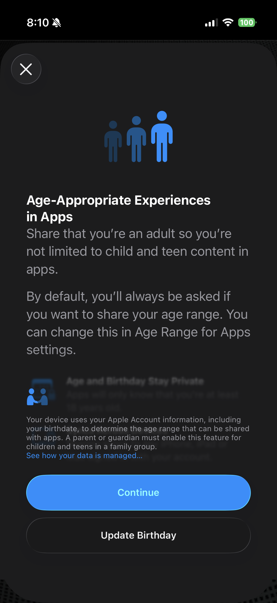
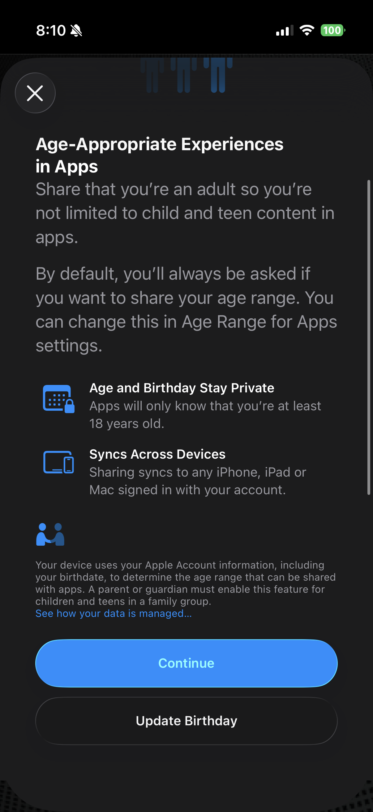
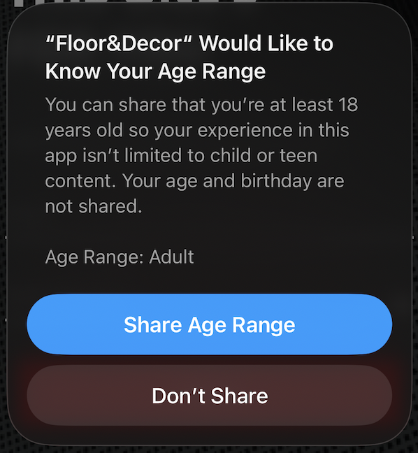
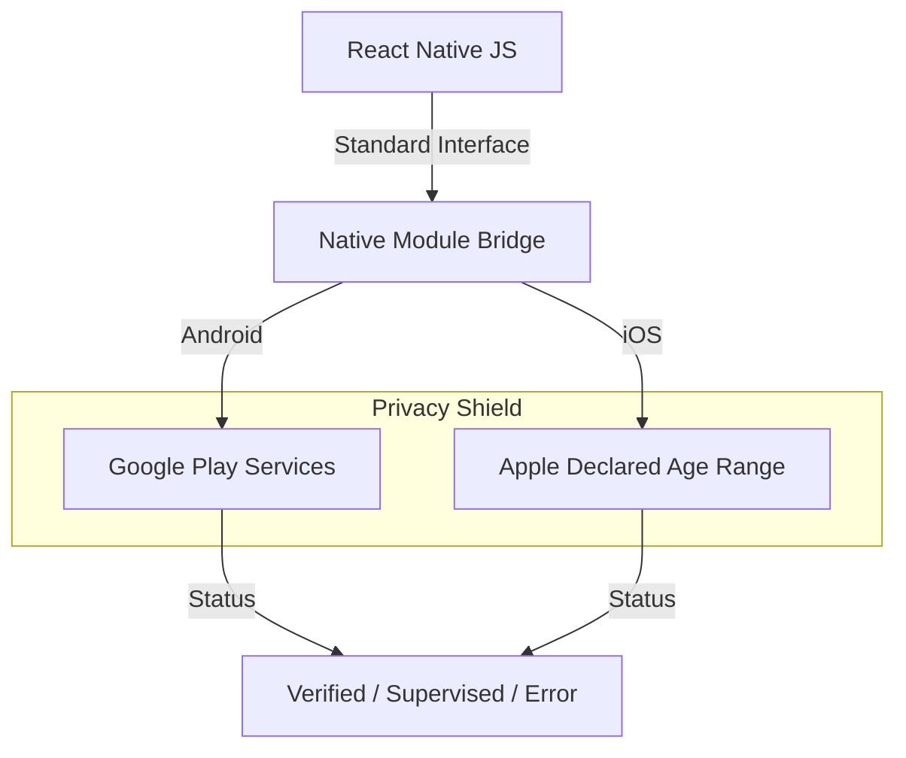

## 📱 Live Demos

### Screen Recordings

| Android | iOS |
|:-------:|:---:|
|  |  |

### iOS Age Verification Modal (Real Device)

| Step 1 | Step 2 | Modal |
|:------:|:------:|:-----:|
|  |  |  |

### Example App UI

| iOS UI | Android UI |
|:------:|:----------:|
|  |  |

# React Native Store Age Signals

[](https://www.npmjs.com/package/react-native-store-age-signals-native-modules)
[](LICENSE)
[](https://facebook.github.io/react-native/)
[](https://www.typescriptlang.org/)

**A production-grade React Native module for verifiable age signals.**

Seamlessly integrate with **Apple's Declared Age Range API** (iOS 26+) and **Google Play Age Signals API** to meet state-level age verification compliance (e.g., Texas, Utah, Louisiana) without handling sensitive PII yourself.

> **⚠️ COMPLIANCE NOTICE**: Texas [SB2420](https://legiscan.com/TX/text/SB2420/id/3237346/Texas-2025-SB2420-Enrolled.html) **requires** apps to consume age signals from app stores starting **January 1, 2026**. Similar laws in Utah (May 7, 2026) and Louisiana (July 1, 2026) are also taking effect. This package provides the necessary integration for React Native apps.

**Keywords**: `age verification`, `texas sb2420`, `age gate`, `parental controls`, `coppa compliance`, `react native age verification`, `google play age signals`, `ios declared age range`, `app store age verification`, `react native compliance`, `child safety`, `age appropriate design code`

---

## 🚀 Features

- **🛡️ Privacy-First**: Leverages OS-level store APIs. **No access to birthdates or PII** — only age range classifications.
- **🍎 iOS Integration**: Native support for `DeclaredAgeRange` framework (iOS 26.0+).
- **🤖 Android Integration**: Official wrapper for Google Play `AgeSignalsApi`.
- **🧪 Mock Mode**: Built-in developer tools to simulate all age scenarios on Simulators and Emulators.
- **⚡ Zero Config Mocks**: Verification logic works out-of-the-box for development.
- **📱 Broad Compatibility**: Works with any React Native version (0.60+) — uses legacy native module architecture.

## 🏗️ Architecture



## 📦 Installation

```sh
npm install react-native-store-age-signals-native-modules
# or
yarn add react-native-store-age-signals-native-modules
```

## ⚙️ Setup

### 🍎 iOS Setup

1.  **Framework Requirements**:
    - **iOS 26.0+** is required for the `DeclaredAgeRange` API to function.
    - Older versions will return a fallback/unavailable response.

2.  **Install Pods**:
    ```sh
    cd ios && pod install
    ```

3.  **Entitlements (Critical)**:
    - You **must** enable the `Declared Age Range` capability in Xcode.
    - Go to **Project Target** -> **Signing & Capabilities** -> **+ Capability** -> **Declared Age Range**.
    - *Note: This capability typically requires a paid Apple Developer Program membership. "Personal Team" profiles may not support it.*

4.  **⚠️ Apple API Limitations**:
    - **Minimum Range Duration**: Age thresholds must create ranges of **at least 2 years**.
    - **Example**: Thresholds `10, 13, 16` work because they create: Under 10, 10-12 (2 yrs), 13-15 (2 yrs), 16+.
    - **Invalid Example**: `13, 14, 21` would fail because 13-14 is only 1 year.
    - Common working combinations: `10, 13, 16` or `13, 16, 18` or `13, 17, 21`.

### 🤖 Android Setup

No manual configuration required. The package automatically bundles `com.google.android.play:age-signals`.
- **Requirement**: Device must have Google Play Services installed.

## 💻 Usage

```typescript
import { 
  getAndroidPlayAgeRangeStatus, 
  requestIOSDeclaredAgeRange 
} from 'react-native-store-age-signals-native-modules';
import { Platform } from 'react-native';

// 🤖 Android Example
async function checkAndroid() {
  if (Platform.OS !== 'android') return;

  const result = await getAndroidPlayAgeRangeStatus();

  if (result.userStatus === 'OVER_AGE') {
    // ✅ User is a verified adult
    grantAccess();
  } else if (result.userStatus === 'UNDER_AGE') {
    // ⚠️ User is supervised (e.g. Family Link)
    // result.ageLower and result.ageUpper are available (e.g., 13-17)
    enableRestrictedMode(result.ageLower, result.ageUpper);
  } else {
    // ❌ Verification failed or unknown
    handleError(result.error);
  }
}

// 🍎 iOS Example
async function checkIOS() {
  if (Platform.OS !== 'ios') return;

  try {
    // Request discrete age signals (e.g. 13+, 17+, 21+)
    const result = await requestIOSDeclaredAgeRange(13, 17, 21);

    if (result.status === 'sharing') {
      // ✅ User shared their age range
      console.log(`Confirmed Range: ${result.lowerBound} - ${result.upperBound}`);
    } else {
      // ❌ User declined or API unavailable
      console.log('Status:', result.status);
    }
  } catch (error) {
    console.error('iOS Signal Failed:', error);
  }
}
```

## 🧪 Developer Mock Mode

Testing store APIs usually requires signed production builds. This library includes a powerful **Mock Mode** for development.

```typescript
// Simulate a Supervised User (Age 13-17)
const mockResult = await getAndroidPlayAgeRangeStatus({
  isMock: true,
  mockStatus: 'UNDER_AGE',
  mockAgeLower: 13,
  mockAgeUpper: 17
});
```

## 🔧 API Reference

### `getAndroidPlayAgeRangeStatus(config?)`
Retrieves Android Play Age Signal.

| Parameter | Type | Default | Description |
|---|---|---|---|
| `config.isMock` | `boolean` | `false` | Enable to return fake data. |
| `config.mockStatus` | `enum` | `'OVER_AGE'` | `OVER_AGE` \| `UNDER_AGE` \| `UNKNOWN` |
| `config.mockErrorCode` | `number` | `null` | Simulate API error code (e.g. -1). |

### `requestIOSDeclaredAgeRange(threshold1, threshold2, threshold3)`
Request iOS Age Signal.

| Parameter | Type | Description |
|---|---|---|
| `threshold[1-3]` | `number` | Age thresholds to verify. **Must create 2+ year ranges**. |

**⚠️ Apple API Constraint**: Thresholds must result in age ranges of at least 2 years duration.
- ✅ **Valid**: `10, 13, 16` → Creates ranges: <10, 10-12, 13-15, 16+
- ✅ **Valid**: `13, 17, 21` → Creates ranges: <13, 13-16, 17-20, 21+
- ❌ **Invalid**: `13, 14, 21` → 13-14 is only 1 year (API will reject)

**Returns**: `Promise<DeclaredAgeRangeResult>`
- `status`: `'sharing' | 'declined' | null`
- `lowerBound`: `number | null` - Lower age of user's range
- `upperBound`: `number | null` - Upper age of user's range
- `parentControls`: `string | null` - Parental control status

## 🚨 Troubleshooting

### iOS Errors

| Error Code | Meaning | Solution |
|---|---|---|
| **Error 0** | **Missing Entitlement** | 1. Add `Declared Age Range` capability in Xcode.<br>2. Ensure you are using a **Paid Developer Account**. Personal teams often block this API.<br>3. **Real Device Only**: This API does NOT work on Simulators. |
| **Error -1** | **API Unavailable** | Device is running an iOS version older than 26.0. |

### Android Errors
## 📚 Additional Resources

### Android Error Codes Reference

| Code | Error | Description | Retryable |
|---|---|---|---|
| -1 | API_NOT_AVAILABLE | Play Store app version might be old. | Yes |
| -2 | PLAY_STORE_NOT_FOUND | No Play Store app found. | Yes |
| -3 | NETWORK_ERROR | No network connection. | Yes |
| -4 | PLAY_SERVICES_NOT_FOUND | Play Services unavailable or old. | Yes |
| -5 | CANNOT_BIND_TO_SERVICE | Failed to bind to Play Store service. | Yes |
| -6 | PLAY_STORE_VERSION_OUTDATED | Play Store app needs update. | Yes |
| -7 | PLAY_SERVICES_VERSION_OUTDATED | Play Services needs update. | Yes |
| -8 | CLIENT_TRANSIENT_ERROR | Transient client error. Retry with backoff. | Yes |
| -9 | APP_NOT_OWNED | App not installed by Google Play. | No |
| -100 | INTERNAL_ERROR | Unknown internal error. | No |

---

## 🤝 Contributing

See the [contributing guide](CONTRIBUTING.md) to learn how to contribute to the repository and the development workflow.

## 📄 License

MIT

---

**Made with ❤️ for React Native developers navigating age verification compliance.**
